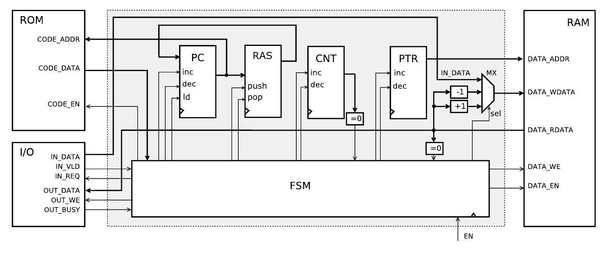
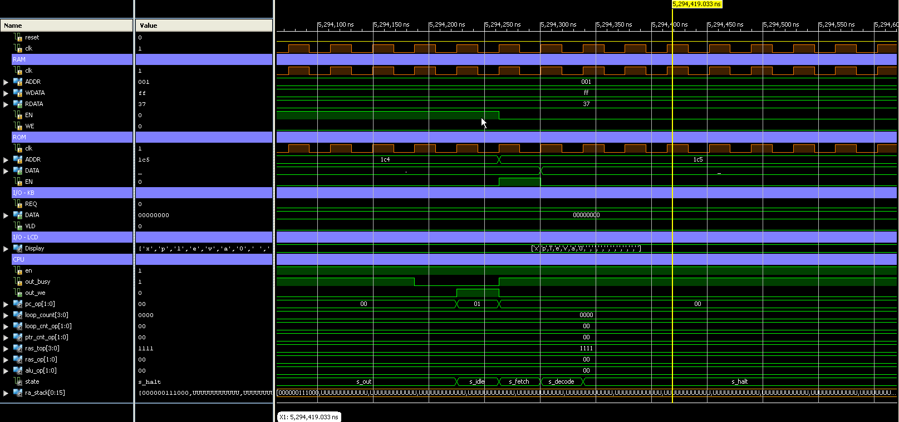

# Brainfuck vhdl processor
Simple Brainf*ck processor writed on vhdl. Semestral project for INP BUT FIT

### Instruction set
| command | OP   |                                              | c pseudo code          |
|---------|------|----------------------------------------------|------------------------|
|  >      | 0x3e | increment pointer                            | ptr++;                 |
|  <      | 0x3c | decrement pointer                            | ptr--;                 |
|  +      | 0x2b | increment data on pointer                    | data[ptr]++;           |
|  -      | 0x2d | decrement data on pointer                    | data[ptr]--;           |
| [       | 0x5b | cycle begin                                  | do {                   |
| ]       | 0x5d | jump to cycle begin if data on pointer not 0 | } while(data[ptr] != 0)|
| .       | 0x2e | write data on pointer to output              | out = data[ptr]        |
| ,       | 0x2c | write input to data on pointer               | data[ptr] = in         |
| null    | 0x00 | stop work. Only restart to start again       | exit();                |

### Ports
```vhdl

CLK   : in std_logic;  -- clock signal
RESET : in std_logic;  -- async reset signal
EN    : in std_logic;  -- enable processor
 
-- sync memory ROM
CODE_ADDR : out std_logic_vector(11 downto 0); -- address for code ROM memory
CODE_DATA : in std_logic_vector(7 downto 0);   -- CODE_DATA <- rom[CODE_ADDR] when CODE_EN='1'
CODE_EN   : out std_logic;                     -- memory enbale signal
   
-- sync memory RAM
DATA_ADDR  : out std_logic_vector(9 downto 0); -- address for data memory
DATA_WDATA : out std_logic_vector(7 downto 0); -- ram[DATA_ADDR] <- DATA_WDATA when DATA_EN='1'
DATA_RDATA : in std_logic_vector(7 downto 0);  -- DATA_RDATA <- ram[DATA_ADDR] when DATA_EN='1'
DATA_WE    : out std_logic;                    -- read (0) / write (1)
DATA_EN    : out std_logic;                    -- memory enbale signal
   
-- input port
IN_DATA   : in std_logic_vector(7 downto 0);   -- IN_DATA <- INPUT when IN_VLD='1' and IN_REQ='1'
IN_VLD    : in std_logic;                      -- is data valid
IN_REQ    : out std_logic;                     -- data request signal
   
-- output port
OUT_DATA : out  std_logic_vector(7 downto 0);  -- data output
OUT_BUSY : in std_logic;                       -- is out device BUSY
OUT_WE   : out std_logic                       -- outdevice <- OUT_DATA when OUT_WE='1' and OUT_BUSY='0'
```
### Block schema


### Simulation

